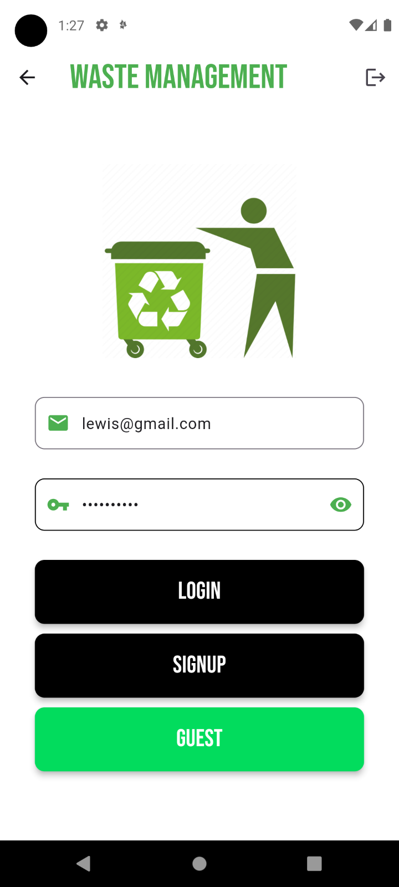
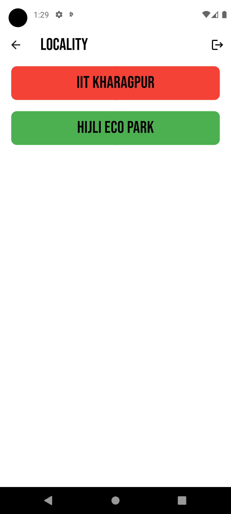
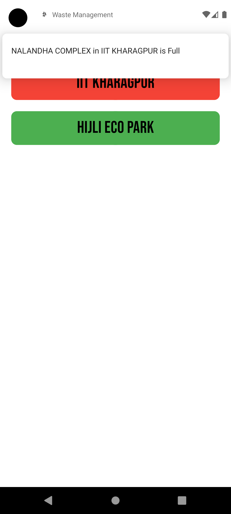

# WASTE MANAGEMENT APP

The waste management app provides a comprehensive solution for monitoring and managing waste in public spaces. Developed using Flutter and Firebase, the app allows users to track waste bin locations, receive real-time updates on bin status, and efficiently navigate to nearby bins for waste disposal. With features such as user authentication, dynamic marker placement, and route visualization, the app promotes sustainability and effective waste management practices within the community.

## Getting Started

A few resources to get you started if this is your first Flutter project:

- [Lab: Write your first Flutter app](https://docs.flutter.dev/get-started/codelab)
- [Cookbook: Useful Flutter samples](https://docs.flutter.dev/cookbook)

## App Pages

<table>
  <tr>
    <td style="text-align: center;">LOGIN SCREEN</td>
    <td style="text-align: center;">SIGNUP SCREEN</td>
    <td style="text-align: center;">HOME SCREEN</td>
  </tr>
  <tr>
    <td></td>
    <td></td>
    <td></td>
  </tr>
  <tr>
    <td style="text-align: center;">BIN SCREEN</td>
    <td style="text-align: center;">MAP SCREEN</td>
    <td style="text-align: center;">NOTIFICATION</td>
  </tr>
  <tr>
    <td></td>
    <td></td>
    <td></td>
  </tr>
</table>

